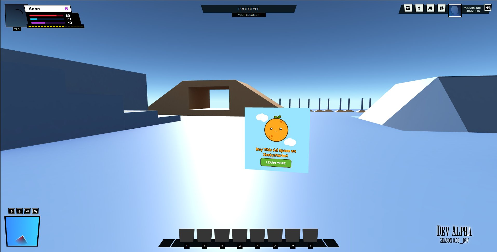

# Litepaper

## Changelog

* Version 1.0 (Oct 2022)
  * Major changes to the litepaper to reflect learning
  * Introduction of Data Appchain as the successor to Beacons
  * Introduction of the Zesty Token Network

* Version 0.3 (Dec 2021)
  * Added "Changelog"
  * Update Abstract to reflect changes in product
  * ”Metaverse” —> "Building the Open Metaverse"
  * "Scarcity and Cash Flow" —> "Tokenizing Attention and Building Bridges"
  * "How it Works" —> "System Design"
  * Add "Beacons"
* Version 0.2 (May 2021)
  * Refine wording
* Version 0.1 (Jan 2021)
  * Initial ideation

## Abstract

We are building the data layer for the Metaverse. This is done through an interoperable SDK that works across multiple web and game engines. The SDK is then able to transport data to and from various experiences powering various data-driven applications (discovery, monetization, analytics, and more). Zesty seeks to be a middleware platform across the Metaverse providing bridges across the currently siloed experiences. Governance and value capture of data will be distributed and made decentralized to users of the platform through tokens that are emitted from the use of the platform.

## Introduction

Since its introduction in Snowcrash, The Metaverse has been a subject of human imagination for multiple decades, with different interpretations of the term circulating the Internet’s psyche for a while now. The transition from physical worlds to digital worlds had already begun, however, this is mostly limited to 2D interfaces with additional interactivity. We see the subsequent advances in Metaverse technology being able to humanize the digital experience further. In our own words, we would describe a metaverse as the next iteration for the Internet to make from a mainly 2D interface to an always-on, real-time 3D environment that allows its users to communicate with each other.

For the Metaverse to succeed, there needs to be things to do, people to meet, and games to play. We believe in a pluralistic metaverse where there will not be one single winner, but the metaverse will be as diverse as the Internet today, with different communities building for themselves and for each other. As such, there will need to be tools to help support and bridge the diverse ecosystem. Metaverse data, a product of interaction with the virtual spaces, becomes a necessary resource to help mediate this complexity and to build better applications. Zesty’s vision is to provide a unified data protocol which allows these communities to share data and information with each other in a way that preserves privacy and protects each user’s sovereignty.

The Metaverse will turn the human experience into a computation problem. The need for user sovereignty over Metaverse data will be increasingly important. Given the increased immersiveness of platforms, it becomes possible to track wallet activity, people’s gaze, variable heart rates, brain activity, and more as sensor technology improves. Metaverse data will be very valuable and given its invasiveness, we would want users to have ownership of such data. Zesty seeks to be the ground up initiative that would spearhead user sovereignty in the Metaverse.

## Protocol Overview

The Zesty Protocol is made of three major parts.
1. An interoperable SDK that can integrate in a variety of game engines and platforms.
2. A Data Appchain which stores and propagates the data. This is centralized at the moment to allow for fast iteration and learning.
3. Data Applications which consume the Metaverse data to power a variety of use cases.

SDK → Data Appchain → Data Applications (consumers)

These three parts are intertwined and interdependent. Developers integrate the SDK so that they are able to use data applications that the SDK offers. As of now (Oct 2022) the Data Appchain is a centralized server that mediates the flow of data between the SDK and Data Applications. The centralized version offered the early community to experiment on the specifications and code required to store Metaverse data. The subsequent version of Zesty seeks to migrate this centralized implementation into a decentralized version through a Data Appchain.

The Zesty Protocol will evolve as more use cases and specifications emerge, as such this Litepaper should be treated as a work in progress.

## SDK

The SDK [https://github.com/zestymarket/sdk](https://github.com/zestymarket/sdk) is a code snippet that integrates across a variety of game engines and Metaverse platforms. Through the code snippet, the Zesty protocol is able to inject additional functionalities into the game engines and Metaverse platforms which helps to power the various Data Applications built. This gives Zesty the ability to build a unified platform across the various Metaverses that would exist despite the incoming fragmentation.



The current manifestation of the SDK is in the form of portals around various virtual worlds. These portals are able to transport people across other games and experiences. While portals are its immediate manifestation, it is possible for the SDK to take on multiple forms in virtual spaces, like meshes, textures, and other forms of interactions. The portals created then offer the ability for virtual world creators to monetize their creations through non-disruptive in-game advertising. Further token incentives to bootstrap SDK adoption is made possible through the various Data Applications and Data Appchain.

The SDK then logs anonymized GDPR compliant data regarding usage around its vicinity subject to a user’s approval. The node where the data would be logged can be selected by a user or allocated to an endpoint provided by the various Data Appchain nodes. This data then powers Data Applications: identity, analytics, discovery, and more should the community spearhead more initiatives.


## Data Appchain

The current specifications for the Data Appchain is being implemented through a centralized server to better understand the specifications before implementing it as an Appchain. We acknowledge that building out the Appchain for this is a significant undertaking and will want to validate use cases more before committing to more specifications. The specification written here is a document in progress.

The current Zesty protocol (Oct 2022) is looking to plan for the transition of the data into the Appchain built using the Cosmos SDK and Tendermint consensus.

The data around the Zesty protocol is centered around event logs in the form of a JSON object.

```json
{
  "id": "<string consisting of a sha256 hash of the other JSON fields>",
  "location": "<string denoting the location of where the log was collected>",
  "event_type": "<string denoting the kind of event>",
  "timestamp": "<unsigned integer>",
  "context": "<an object consisting of additional information about the event>"
}
```

The JSON object works with No SQL databases and allows for the sharding and distribution of data across various Data Appchain nodes. Large scale queries can be facilitated through the use of libraries like [Apache Drill](https://drill.apache.org/).

The hashed id then allows for the various nodes to propagate data to other Data Appchain nodes as they should be unique. The various Data Appchain nodes will have to pay other Data Appchain nodes for the replication of unique data points. This prevents freeloader nodes from data mining from other Data Appchain nodes without contributing storage and compute power to the network to acquire Metaverse data.

Note that this No SQL data stored by the various nodes in the Appchain is separate from the consensus and blockspace handling tokens and other on-chain data. The Metaverse data and on-chain data will exist as separate modules. Metaverse data unlike on-chain data does not have the same adversarial threat vectors as real-time consensus is not required. Transaction and token accounting is not handled in the Metaverse data module. Quality of Metaverse data can be assessed through [Anomaly Detection techniques](https://cs.brown.edu/courses/csci2270/archives/2017/papers/anomoly-survey.pdf).

Users can run their own Data Appchain node to log their own usage information by specifying the rpc endpoint of a specific node, or rely on other Data Appchain nodes on the network. To run a Data Appchain node, users are required to stake a minimum amount of tokens to secure the node, the tokens staked will receive staking rewards and additional transaction fees should data be used. Other users can nominate trusted Data Appchain nodes to receive a share of staking rewards and fees to help secure the nodes. Byzantine nodes and unavailable nodes will have their stake slashed over time.

While the initial Appchain use case will revolve around Metaverse data around Zesty, we envision future use cases with regards to its usage through other DeFi and cross chain applications in future.

## Data Applications

### Identity

Users who encounter the Zesty SDK and had agreed to have data be logged would leave a trail of logs in the various Data Appchain nodes. A user id will be assigned to a user which can be stored in local storage and can be used to claim token rewards from the Data Appchain by creating a wallet on the Appchain. A merkle tree of logged data will also be stored locally, this merkle proof and user id can then be fed to the Appchain to claim token rewards. A user can return the token rewards to the network and submit a delete request to the Appchain for the logged data to be removed.

Should users be comfortable with the data that has been logged, such identity data can be used by other games and Metaverse experiences for the purpose of user segmentation and understanding user behaviors. Creators of games and experiences, using the Identity application of the Data Appchain, can then figure out campaigns to attract power users to their experiences and to create more engaging experiences.

### Analytics

The Metaverse log data provides the ability for creators to understand the pathways of engagement in their games and experiences. This allows creators to figure out whether users are dropping off or are engaged with the games. Through the shared data layer, creators can also understand how other games and experiences perform relatively to theirs.

Power users of the Data Appchain will be able to run nodes themselves to understand users better, or rely on other Data Appchain nodes for this service. It is possible for other client applications to be able to collate the data from Data Appchain nodes on users behalf and create other data applications for the analytics. To help support development for creators, Data Appchain nodes can provide freely or cheaply up till a certain amount of calls to the network after which some kind of token payment will be required.

### Search and Discovery

The Metaverse log data also provides the ability to create data applications to enable search and discovery of games and experiences. Indexing the spatial web and games has been a challenge since they do not allow for search spiders due to most of the content not being in html tags.

The log data allows for the use of clustering techniques to find a taxonomy to the various spaces to connect users based on their identity profiles to other experiences and games they may like. Data applications can use the data to create curated experiences for their users.

The manifestation of the SDK as portals across various games and experiences allow users to explore and discover new content without disrupting the game play.

### Advertising

Through the Metaverse log data and the portal mechanism, the SDK allows for advertising as a value capture mechanism. Metaverse Advertising will enrich experiences instead of making experiences worse. Other experiences and games are able to leverage on more popular experiences and direct users to their creations through the use of incentivized portals.

Beyond portals, the SDK with the ability to put assets in game engines and platforms has the ability to introduce new texture to reskin in-game assets, or introduce new objects in spaces for people to interact with. This provides a wider range of interactions that introduces a sense of novelty and exploration in worlds.

The log data then allows for the appropriate pricing of advertising slots given the amount of impressions and clicks that an experience should receive. The various advertising settlement smart contracts will need to query the Data Appchain for the log information to price the slots and payout accordingly to creators.

The various portals associated with creators are tokenized in the form of NFTs, this allows for the tracking of cash flows associated with those portals. The NFTs with cash flows and advertising settlement smart contracts will be able to enable further financial applications for creators like underwriting loans and insurances.

### Other Applications

The Data Appchain provides a substrate for other possible applications to be built on it, games, experiences, and data powered NFTs. The current Data Applications listed are not complete. Through data ownership and token incentives, Zesty hopes to enable the community to build on top of the data rails built.

## Tokenomics


The SDK, Data Appchain, and Data Applications gives the protocol a number of potential sinks and faucets. The burn associated with sinks and emissions faucets can be adjusted through governance of the platform. The optimal values will likely be dynamic given how the ecosystem evolves. We anticipate that token incentives to bootstrap SDK adoption and Data appchain node at the very beginning will be where most of the emissions will occur. The rate of distribution will be designed to start at a fairly fast rate to bootstrap adoption and then decay

The initial bootstrapping phase of the Zesty protocol will start on Ethereum. Liquidity will be bootstrapped through a streaming auction which should provide the initial core team with additional funds to operate and provide liquidity for an initial DEX pool for protocol tokens ($ZESTY). The initial funds will then be held in an operational multisig to help fund development of the protocol. Tokens allocated to team, backers, and initial adopters will be held in a vesting contract, locked for at least 1 year and then vested linearly for the next 2 years after the 1 year lock passes. The insider allocation will be kept at less than 1/3 of the network to encourage future network ownership but should be generous enough to reward early participants for work already contributed to the network.

The ecosystem fund will be managed via a multisig owned by the Zesty team and will be used for initial token incentives prior to the launch of the Data Appchain. The remaining protocol tokens will be locked only to be activated by the launch of the Data Appchain. The activation will happen only after the approval by the operational multisig and a majority token vote approval. The ERC20 and Appchain $ZESTY token will exist alongside one another thereafter.
