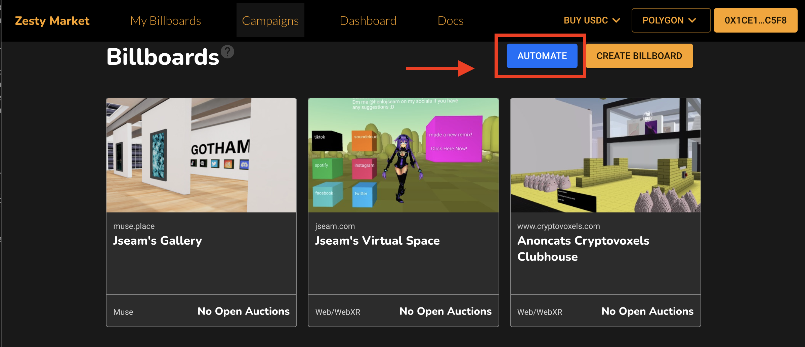
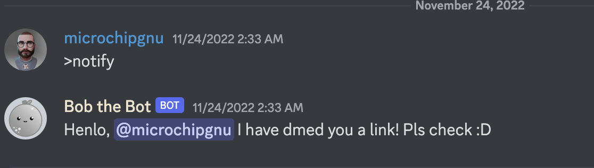

# Automation
It is possible to automate the management of spaces, this is done by setting a bot as an operator on the Zesty Market contract to help call smart contract funcionts on your behalf.

We have built out a bot to help you with this. The bot currently at the supports:

1. Auction creation
2. Auction approvals and rejections (TBD): As of now creators will need to be responsible for the content that shows on their spaces.
3. Auction expiration and cancelations
4. Withdrawal of funds

## Steps to Setup Automation

### UI-V1
1. Head over to [app.zesty.market](https://app.zesty.market). Connect your wallet.

2. Go over to [My Billboards](https://app.zesty.market/spaces).

3. Click on the automation button. There will be a prompt that will request you to approve an operator. The operator approved will be the bot the Zesty team provides. The bot can only manage your auctions and has no access to your funds. Auctions will be created daily starting from 00:00 UTC to 23:59 UTC. Prices are estimated based on the number of clicks and visits a space gets.

4. Once the transaction is confirmed on-chain, the bot will begin to manage your auctions. The onchain calls are triggered once every 4 hours, give it a while to begin running functions onchain.

5. To be notified when you need to approve auctions, head over to our [Discord](https://discord.gg/AgmSxXNdnQ) and go to the `#bot-commands` channel. Type `>notify` and you will be guided through a set of prompts on your Discord Direct Messages. After which, `Bob the Bot` in the Zesty Discord will inform you when you have spaces to approve or reject.

If there are any further questions or issues head over to our [Discord](https://discord.gg/AgmSxXNdnQ) and ask the Zesty Team.